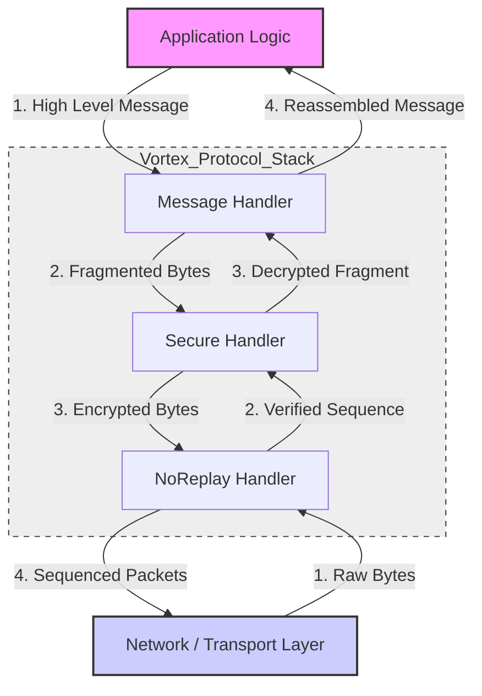

# Vortex Protocol

**Vortex** is a robust, modular, and secure networking protocol layer implemented in Dart. It provides a chain-of-responsibility architecture to handle complex networking requirements such as message fragmentation, end-to-end encryption, and reliable packet sequencing over an abstract transport layer.

This library is designed to be transport-agnostic, meaning it can run over TCP, UDP, WebSockets, or any custom byte-stream channel, provided the chain implementation bridges to the underlying network.

## Key Features

*   **Modular Architecture**: Built on a strictly typed `Handler` and `Chain` abstraction, allowing developers to plug and play different protocol layers.
*   **Reliability & Ordering (`NoReplayHandler`)**:
    *   Implements a TCP-like state machine (SYN, ACK, SYNACK, FIN, DATA).
    *   Guarantees packet sequencing and prevents replay attacks.
    *   Handles checksum verification to ensure data integrity.
*   **End-to-End Security (`SecureHandler`)**:
    *   **Key Exchange**: Uses Elliptic Curve Diffie-Hellman (ECDH) via `secp256k1`.
    *   **Encryption**: Symmetric encryption using AES (ECB mode with unique session keys).
    *   **Signatures**: Verifies handshake integrity using digital signatures.
*   **Message Fragmentation (`MessageHandler`)**:
    *   Automatically splits large application messages into smaller binary chunks (parts).
    *   Reassembles parts into full messages on the receiving end.
    *   Uses an LRU Cache to manage pending partial messages to prevent memory leaks.
*   **Type Safety**: heavily utilizes Dart generics for strongly typed message IDs and payloads.

## Architecture

The Vortex architecture operates as a pipeline. Data flows from the Application layer down through handlers which transform the data (serialize, encrypt, sequence) before sending it to the network. Incoming data flows in reverse.



### Logic Flow

1.  **MessageHandler**: Takes a high-level object, serializes it, and breaks it into chunks based on a defined `Spec`.
2.  **SecureHandler**: Encrypts the payload. If the connection is new, it pauses traffic to perform a Handshake (Key Exchange).
3.  **NoReplayHandler**: Wraps the encrypted payload with sequence numbers and headers (SYN/ACK) to ensure the peer receives packets in the correct order.

## Installation

Add the necessary dependencies to your `pubspec.yaml`. Based on the imports used in the source code, you will likely need the following:

```yaml
dependencies:
  vortex:
    path: ./  # Or git url
  retry: ^3.1.0
  convert: ^3.0.0
  encrypt: ^5.0.0
  flutter_sodium: ^0.2.0
  hashlib: ^1.0.0
  secp256k1: ^0.3.0
  synchronized: ^3.0.0
```

## Usage

To use Vortex, you must implement the `Spec` class to define how your specific message types and IDs are converted to bytes.

### 1. Define your Protocol Specification

```dart
import 'package:vortex/net/abstraction/impl/message/types.dart';

// Example implementation of the Spec class
class MyProtocolSpec extends Spec<MyType, int> {
  @override
  int get partSize => 1024; // Split messages > 1KB

  @override
  Checksum get checksum => MyChecksumImpl();

  // Implement converters for your ID and Type Enums...
  @override
  Converter<int> get messageIdConverter => MyIdConverter();
  
  @override
  Converter<MyType> get messageTypeConverter => MyTypeConverter();
  
  // ... implement other abstract getters
}
```

### 2. Initialize and Chain Handlers

You need to link the handlers together. This usually involves creating a chain class that passes data between layers.

```dart
import 'package:vortex/net/abstraction/impl/message/handler.dart';
import 'package:vortex/net/abstraction/impl/secure/handler.dart';
import 'package:vortex/net/abstraction/impl/noreplay/handler.dart';

void main() async {
  // 1. Setup Message Layer
  final spec = MyProtocolSpec();
  final partReader = PartReader(spec);
  final messageWriter = MessageWriter(spec);
  
  final messageHandler = MessageHandler(
    partReader, 
    messageWriter, 
    60 // Window in seconds to keep pending parts
  );

  // 2. Setup Security Layer
  final secureHandler = SecureHandler();

  // 3. Setup Reliability Layer
  final noReplayHandler = NoReplayHandler();

  // Note: You must implement the glue code (Chain implementation) 
  // to pass calls from messageHandler -> secureHandler -> noReplayHandler -> Network
  
  print("Vortex Stack Initialized");
}
```

## Project Structure

The codebase is organized by abstraction layers and their specific implementations.

*   **`lib/net/abstraction/`**
    *   `handler.dart`: The core interfaces `Handler<In, Out>` and `Chain<In, Out>`.
    *   **`impl/message/`**:
        *   `handler.dart`: Logic for splitting and reassembling messages (`MessageHandler`).
        *   `types.dart`: Definitions for `Message`, `MessagePart`, `Spec`, and `PartReader/Writer`.
    *   **`impl/secure/`**:
        *   `handler.dart`: Logic for encryption and key exchange (`SecureHandler`).
        *   `types.dart`: Cryptographic helpers (BigInt conversion, padding, random generation).
    *   **`impl/noreplay/`**:
        *   `handler.dart`: Logic for sequencing and connection state (`NoReplayHandler`).
        *   `types.dart`: Packet types (`SYN`, `ACK`, `DATA`, `FIN`) and state machine logic.
    *   **`common/`**:
        *   `types.dart`: Shared binary types and `Num` extension for easy byte serialization.
*   **`lib/utils/`**
    *   `cache.dart`: A generic LRU (Least Recently Used) cache with time-based expiration, used by the MessageHandler.
